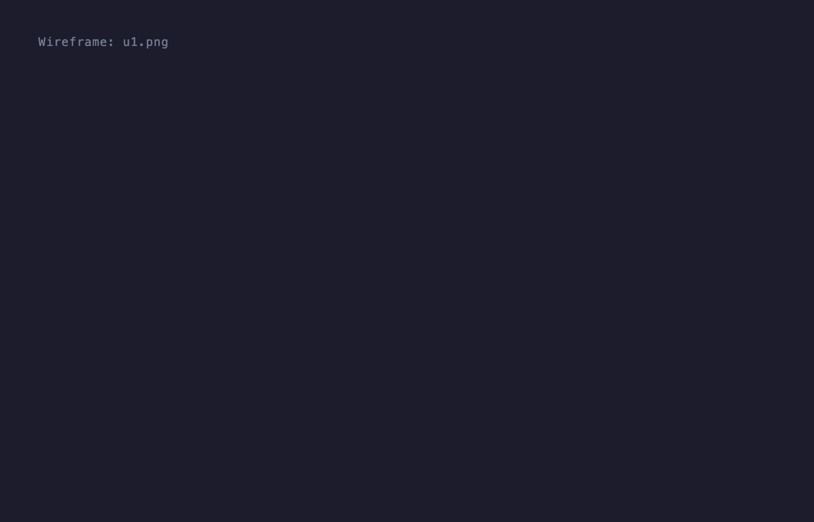

# LadderChat — Human-in-the-Loop Interview Tool

[](https://arxiv.org/html/2608.17029v1)
[](https://www.jamphd.com/research.html)
[](https://craves-lite.onrender.com)
[](mailto:Manjushree.aithal@cuanschutz.edu)

> Companion code for **"LadderTeam: Dual-Agent Laddering Elicitation Framework"** - Venue: ACM AI Summit 2026.
>
> **Authors:** Manjushree Aithal, Alexander Kotz, James Mitchell

---
## About
LadderTeam is a research prototype for running **structured qualitative interviews** where an LLM acts a the interviewer and a human answers. It implements the Reynolds & Gutman (1988) laddering methodology with three probing strategies (ACV, 5-Whys, JTBD) and a separate judge LLM that scores interview quality in real time. Built to study whether LLM interviews can surface actionable design insight from wireframe evaluations.

---

## How it works




*Two-agent architecture: an interviewer LLM probes the user turn-by-turn while a judge LLM scores each exchange in real time and (optionally) injects tactic feedback into the next question.*

```
Wireframe image(s)
      │
      ▼
Interviewer LLM ──► Question displayed in terminal
                          │
                    Human types answer
                          │
                    Judge LLM scores silently
                          │
                    Interviewer LLM generates next question
                          │
                    ... repeats until chain is complete ...
                          │
                    Judge LLM writes end-of-session report
                          │
                    Results saved to results/results_{screen}_{method}_{model}_iterN.json
```


---

## Prerequisites

```markdown
**Python:** 3.10 or later

**Install:**
```bash
pip install -r requirements

Or manually:

```bash
pip install "openai>=1.40" "httpx>=0.27" "anthropic>=0.34"

`httpx` is required for local Ollama runs. `anthropic` is required when `--judge-provider anthropic` is used (the default cloud configuration).

**API keys (cloud mode):**

```bash
export OPENAI_API_KEY=sk-...
export ANTHROPIC_API_KEY=sk-ant-...
```

**Local mode:** requires [Ollama](https://ollama.com) running with models pulled:

```bash
ollama pull gemma4:12b
ollama pull qwen3.6:27b
ollama serve
```

**Vision requirement:** wireframe interviews require a **vision-capable model** for the interviewer role. `qwen2.5:7b` is text-only and will fail. Verified vision models: `gpt-5.5`, `claude-sonnet-4-6`, `gemini-2.5-pro`, `gemma4:12b`, `qwen3.6:27b`.

---

## Running an interview

### Basic command

```bash
python pipeline_p3.py \
  --cloud \
  --provider openai --model gpt-5.5 \
  --judge-provider anthropic --judge-model claude-sonnet-4-6 \
  --laddering-method acv \
  --wireframe-images u1.png
```

### With multiple wireframe screens

```bash
python pipeline_p3.py \
  --cloud \
  --provider openai --model gpt-5.5 \
  --judge-provider anthropic --judge-model claude-sonnet-4-6 \
  --laddering-method jtbd \
  --wireframe-images screen1.png screen2.png screen3.png
```

### Local models (Ollama)

```bash
python pipeline_p3.py \
  --local \
  --model gemma4:12b \
  --judge-model qwen3.6:27b \
  --laddering-method 5whys \
  --wireframe-images u1.png
```

### Skip judge

```bash
python pipeline_p3.py \
  --cloud \
  --provider openai --model gpt-5.5 \
  --laddering-method acv \
  --wireframe-images u1.png \
  --skip-judge
```

---

## Cost and Data privacy
**Cost (cloud mode):** each interview turn issues 2-3 LLM calls (extractor, question generator, judge). A typical 8-turn ACV interview costs roughly **$0.15-0.4** with the default `gpt-5.5` + `claude-sonnet-4.6` pairing. User `--skip-judge`, local mode or shorter methods to reduce cost.

**Data send to third parties (cloud mode):** your typed answers, the vague seed you select, and the wireframe image(s) you pass via `--wireframe-image` are transmitted to the API providers you configure (OpenAI, Anthropic, etc.) subject to their data policies. **Do not upload confidential product mockups or proprietary designs in cloud model.** User `--local` with Ollama for fully on-device runs.

## What happens at runtime

**Step 1 — Initial reaction**

The terminal shows the wireframe path(s) and prompts you to type a 3–5 sentence surface-level first impression. Be vague and mixed — something seems to work, something is uncertain.

**Step 2 — Vague seed**

You pick a short phrase (3–12 words) from your initial reaction for the interviewer to probe. Press Enter to auto-extract.

**Step 3 — Interview**

The interviewer LLM generates a clarification question, then proceeds with the chosen laddering method. Each question is shown in a box:

```
------------------------------------------------------------
  INTERVIEWER ASKS
-───────────────────────────────────────────────────────────
  What is it about the layout that feels off to you?
------------------------------------------------------------

  ▶ You >
```

Type your answer and press Enter. Repeat until the chain terminates naturally.

---

## Laddering methods

| Method | Flag | What it surfaces |
|---|---|---|
| ACV | `--laddering-method acv` | Attribute → Consequence → Value: actionable design requirements |
| 5-Whys | `--laddering-method 5whys` | Causal chain from friction point to root cause |
| JTBD | `--laddering-method jtbd` | Situation → Job → Outcome → Barrier chain |

---

## CLI flags

| Flag | Default | Description |
|---|---|---|
| `--laddering-method` | `acv` | `acv`, `5whys`, or `jtbd` |
| `--wireframe-images PATH…` | required | One or more image paths (PNG, JPG, GIF, WebP) in flow order |
| `--cloud` | default | Use cloud API providers |
| `--local` | — | Use Ollama local models |
| `--provider` | `openai` | Interviewer provider: `openai`, `anthropic`, `gemini`, `ollama`, `openrouter`, `together`, `dashscope` |
| `--model` | `gpt-5.5` | Interviewer model ID |
| `--judge-provider` | `anthropic` | Judge provider |
| `--judge-model` | `claude-sonnet-4-6` | Judge model ID |
| `--judge-active` | — | Judge injects tactic feedback into each next question |
| `--judge-shadow` | default | Judge scores silently, no injection |
| `--skip-judge` | — | Disable judge entirely |
| `--output-dir DIR` | `results` | Where to save the JSON result |
| `--output-filename NAME` | `results_{screen}_{method}_{model}.json` | Override the base output filename (an `_iterN` suffix is always appended) |
| `--vague-seed TEXT` | — | Skip the seed prompt, use this text directly |
| `--prior-response TEXT` | — | Skip the initial reaction prompt, use this text directly |
| `--prior-response-file PATH` | — | Load prior response from a file (safer than `--prior-response` for long/special-char text) |
| `--iterations N` | `1` | Number of complete interview runs. Prior response and vague seed are collected once and reused across all iterations |
| `--seed-only` | — | Collect prior response + vague seed, print as JSON, then exit (no interview) |
| `--fast` | — | Debug mode (with `--local` only): swaps both roles to `qwen2.5:7b` for fast parsing verification |

---

## Default model pairing

| Mode | Interviewer | Judge |
|---|---|---|
| Cloud | `gpt-5.5` (OpenAI) | `claude-sonnet-4-6` (Anthropic) |
| Local | `gemma4:12b` (Ollama) | `qwen3.6:27b` (Ollama) |

The judge must always use a different model than the interviewer — the pipeline exits with an error if they match.

Wireframe interviews require a **vision-capable model**. `qwen2.5:7b` does not support vision and cannot be used as the interviewer.

### Reproducibility

LLM outputs are **non-deterministic**. Re-running the same interview will produce slightly different questions and different judge scores. The models listed above are the versions we tested at the time of the ACM AI Summit 2026 submission. Provider-hosted models are updated over time and may drift.

- All calls use provider defaults for `temperature` and `top_p` (check `_llm_call()` in `ladder_interview.py`)
- To pin behavior for replication, use `--local` with the exact Ollama model tags in the table above
- **Reproducing a ground-truth transcript:** use the same wireframe image, initial response and vague seed from the ground-truth transcript. The interviewer will not ask the *exact* questions from the transcript (LLM outputs vary run-to-run) so match each generated question to the **closest question in the transcript** and paste the corresponding ground-truth answer. Use the transcript as guidance, not as a script.
  
---

## Output

Results are saved to `results/results_{screen}_{method}_{model}_iterN.json` (or the name passed via `--output-filename`, with an `_iterN` suffix appended) and contain:

- `prior_response` — your initial wireframe reaction
- `vague_seed` — the phrase that was probed
- `turns` — list of `{turn, question, answer}` objects
- `interview_summary` — LLM-generated summary of the chain
- `judge_log` — per-turn scores (ladder score, deflection score, tactic, composite)
- `judge_report` — end-of-session efficiency score and missed opportunities

### Example run
A complete example interview is provided in [`results/`], and the wireframe used is [`u1.png`]. Reproduce it with:

```bash
python pipeline_p3.py \
  --cloud --provider openai --model gpt-5.5 \
  --laddering-method acv \
  --wireframe-images examples/wireframe_sample.png
```

## File structure

```
manual_ladder/
├── pipeline_p3.py              # CLI entry point and orchestration
├── ladderchat_interview_p3.py  # Interview engine (all LLM calls, state machines)
├── README.md                   # This file
└── results/                    # JSON outputs (created on first run)
```

## Troubleshooting

| Symptom | Fix |
| --- | --- |
| `open.AuthenticationError` | `export OPENAI_API_KEY=sk-...` before running |
| `anthropic.AuthenticationError` | `export ANTHROPIC_API_KEY=sk-ant-...` before running |
| `ConnectionError` on `--local` | `ollama serve` not running, or model not pulled (`ollama pull gemma4:12b`) |
| Interviewer produces empty questions | You picked a non-vision model for the interviewer role, check the vision requirements in Prerequisites |
| `RuntimeError: judge model must differ from interviewer model` | Change `--judge-model` to a different model than `--model` |
| Ollama returns empty responses on gemma4/qwen3.6 | Thinking-mode suppression issue, pull the exact tags in the model pairing table |

## Intended use and limitations

LadderTeam is a **research prototype** for studying LLM-driven interview methodology. It is not:
- a replacement for real user research with human participants
- a validated qualitative-research instrument

Any use with real human subjects (e.g., recording their answers to study interviewer behavior) requires appropriate IRB/ethics-board approval at your institution.

---

## Citation

If you use LadderTeam in academic work, please cite:

```bibtex
@article{aithal2026ladderteam,
  title={LadderTeam: Dual-Agent Laddering Elicitation Framework},
  author={Aithal, Manjushree and Kotz, Alexander and Mitchell, James},
  journal={arXiv preprint arXiv:2608.17029},
  year={2026}
}
```
---

## License

## Acknowledgments

Developed at the University of Colorado Anschutz Medical Campus. Thanks to reviewers who provided feedback on the interview design.

## Contributing

This is a research prototype and is not actively maintained, but bug reports and reproducibility issues are welcome. Please open a [Github Issue].


